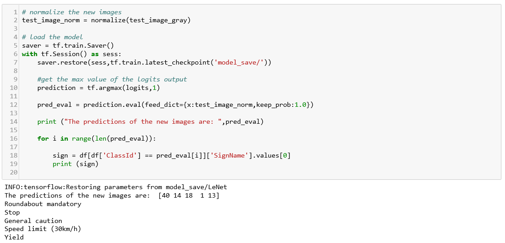

# Traffic Sign Recognition Project

Self-Driving Car NanoDegree

## Overview

In this project, we will use deep neural networks and convolutional neural networks to classify traffic signs. We will train and validate a model so it can classify traffic sign images using the [German Traffic Sign Dataset](http://benchmark.ini.rub.de/?section=gtsrb&subsection=dataset). After the model is trained, we will then try out our model on images of German traffic signs that we find on the web.

The goals / steps of this project are the following:

* Load the data set
* Explore, summarize and visualize the data set
* Design, train and test a model architecture
* Use the model to make predictions on new images
* Analyze the softmax probabilities of the new images
* Summarize the results with a written report

### Dependencies
This lab requires:

* [CarND Term1 Starter Kit](https://github.com/udacity/CarND-Term1-Starter-Kit)

The lab environment can be created with CarND Term1 Starter Kit. Click [here](https://github.com/udacity/CarND-Term1-Starter-Kit/blob/master/README.md) for the details.

## Writeup

### Step 0:Load the data set

In this project,I used the [German traffic signs dataset](https://s3-us-west-1.amazonaws.com/udacity-selfdrivingcar/traffic-signs-data.zip).This is a pikcled dataset in which the images have been already resized to 32x32.

### Step 1: Dataset Summary & Exploration

#### Basic summary

I used python,numpy and pandas methods to calculate the data summary.The basic summary are below:

* Number of training examples = 34799
* Number of validation examples =  4410
* Number of testing examples = 12630
* Image data shape = (32, 32)
* Number of classes = 43

#### Exploration data

* The number distribution of Sign class in training set is below.

* The describe of Sign class Numbers

This distribution is not balanced.Some Sign classes have fewer numbers,but some have more.On training set ,50% of sign classes have less than 540 examples.For some sign classes,the data for training is small.

* I randomly selected 5 images from the training set and displayed them below

Some images are dark and some images are bright.Some images have a messy background and some signs are under shadow.This brings a certain degree of difficulty to training a good model.So,I converted the image to gray image before training model.And,it looks better.

### Step 2:Design and Test a Model Architecture

This is a image classification problem,convolution network is a good solution.I use LeNet-5 model to classify traffic signs.To meet specifications, the validation set accuracy will need to be at least 0.93.

#### Pre-process the Data Set

In this project,the following pre-processing steps are used:

* convert images to grayscale images
* normalize the data
* One-Hot encode the sign classes

#### Build Model Architecture

LeNet-5 is a classic CNN for handwriting recognition.Based on LeNet-5, I made a few changes.

* Input: The input shape should be 32x32x1,and (pixel - 128)/128 is used to normalize the input data
* Layer1:Convolution.The output shape should be 28x28x16
* Activation:ReLu as the activation function
* Pooling: Max pooling.The output shape should be 14x14x16
* Layer2:Convolution.The output shape should be 10x10x32
* Activation:ReLu as the activation function
* Pooling: Max pooling.The output shape should be 5x5x32
* Flatten:Flatten the output shape of the final pooling layer.This should have 800 outputs
* Layer3:Fully Connected.This should have 256 outputs
* Layer4:Dropout.Keep probability should be keep_prob
* Layer5:Fully Connected.This should have 128 outputs
* Layer6:Dropout.Keep probability should be keep_prob
* Layer7:Output.This should have 43 output

#### Optimizer Model

* Loss function: use `tf.reduce_mean(tf.nn.softmax_cross_entropy_with_logits(logits = logits,labels = y))` as loss function and applayed L2 regularization
* Optimizer method:use `AdamOptimizer()` to optimizer the model and learn_rate is 0.001
* Dropout :keep_prob for keep probability for dropout

#### Show Loss and Accuracy

The Training losses on each batch is showed below.And,accuracy on trianing and validation set is showed below. The accuracy on validation set greater than 0.96.

## Test the Model on Test set

The accuracy on Test set is 0.956,greater than 0.93

My final model results are :training set accuracy of 0.9998,validation set accuracy of 0.9635,test set accuracy of 0.956.

I trained the model as follows:

* First,I builded the LeNet model with default parameters,the accuracy on training and validation set showed below.

After 15 training epoches,the accuracy on training set is close to 1,but accuracy on validation set is almost unchanged.And,there is a big gap between them.This means that the model is overfitted.

* Second,I added L2 regularizion and drouput layer on the LeNet model to reduce overfitting.And,I named the model LeNet-1.

The accuracy on validation set is greater then 0.95 and better than LeNet's.The accuracy on test set is 0.939,greater then 0.93.

* Next，based on LeNet-1，I modified the output of convolution layer and fully connected layer.In order to extract features better,I increased the depth of the convolution layers and the number of fully connected layer outputs.I named the model LeNet-2.

The model is overfitted.I reduced the keep probability and increased the L2 regularization. And I named the model LeNet-3.

Finally, several models are summarized as follows:

Layer |	LeNet | LeNet-1 | LeNet-2 |	LeNet-3 |
------|-------|---------| --------| --------|
Input | 32x32x1 |	32x32x1 |	32x32x1 |	32x32x1|
Convolution(5x5) |	1x1 strid ,VALID padding,outputs 28x28x6 |	outputs 28x28x6 |	outputs 28x28x16 |	outputs 28x28x16|
Activation	| RELU	 | RELU	| RELU	| RELU |
MaxPooling	|2x2 stride，outputs 14x14x6	|outputs 14x14x6 |	outputs 14x14x16	|outputs 14x14x16 |
Convolution(5x5) |	1x1 strid,VALID padding,outputs 10x10x16 |	outputs 10x10x16 |	outputs 10x10x32  |	outputs 10x10x32 |
Activation |RELU | RELU |	RELU |	RELU |
MaxPooling	| 2x2 stride，outputs 5x5x16|	outputs 5x5x16 |	outputs 5x5x32	| outputs 5x5x32 |
Flatten		| outputs 400		| outputs 400	| 	outputs 800		| outputs 800	| 
Flully connected	| 	outputs 120		| outputs 120		| outputs 256		| outputs 256	| 
Dropout		| 1	    | 	0.56	| 	0.56	| 	0.5	| 
Flully connected	| 	outputs 84		| outputs 84		| outputs 128		| outputs 128	| 
Dropout	| 	1		| 0.56		| 0.56	| 	0.5	| 
output		| outputs 43		| outputs 43	| 	outputs 43		| outputs 43	| 
Regularizer		| No		| L2 with 0.0005	| 	L2 with 0.0005		| L2 with 0.001	| 
Accuracy on Test set	| 	0.913		| 0.939		| 0.946		| 0.956	| 

## Use the model to make predictions on new images

Download five pictures of German traffic signs from the web and show them below.

Predict the Sign Type for Each Image.The accuracy for these 5 new images is: 0.6

## Analyze the softmax probabilities of the new images 

For each of the new images,the model output the Top 5 softmax probabilities.

## Summary

From the accuracy on the test set,we have reached the goal.The LeNet-5 is very suitable for the task of traffic sign classfication.In the process of training the model,over-fitting appeared.In order to reduce over-fitting,the further improvement methods are as below:

* the data of the validation set is used to train the model,and test the model on test set.
* increase the examples of some traffic sign classes.
* increase the intensity of dropout.

